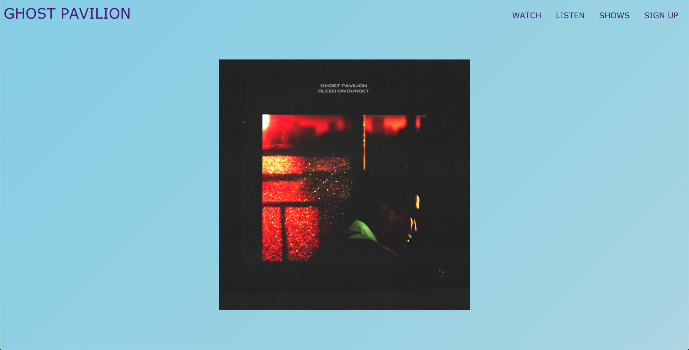
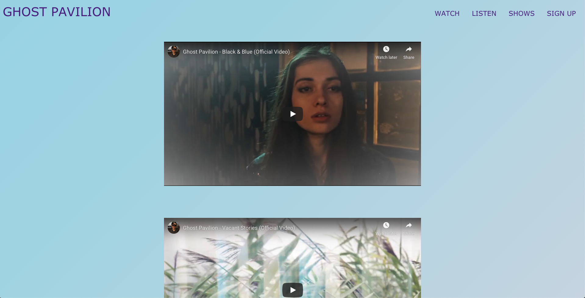
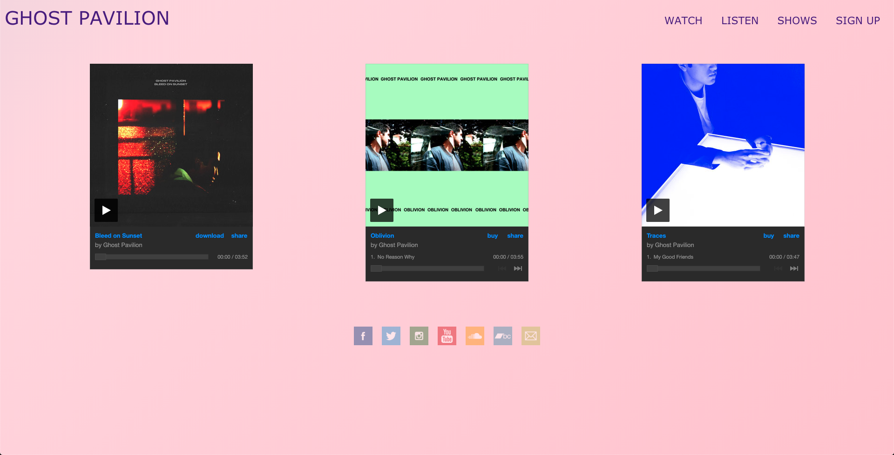
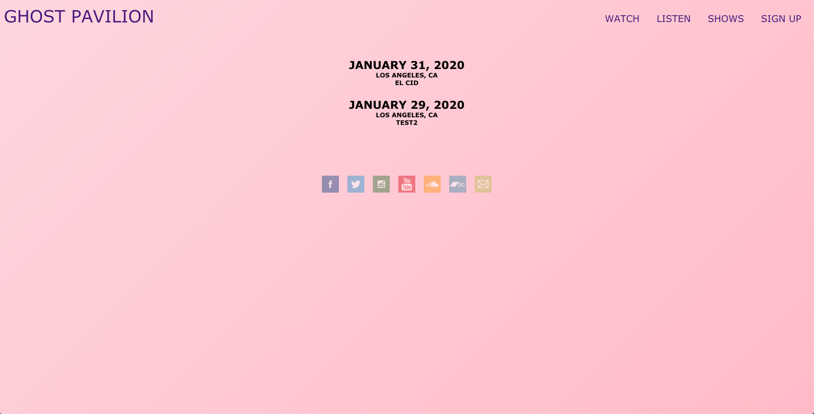

# Ghost Pavilion

https://ghost-pavilion.now.sh/

Ghost Pavilion is a React app which allows you to check out the band's music videos, singles and albums, and upcoming shows. The app also enableds fans to subscribe to the band's email list where they will be notified of upcoming shows, free downloads and more.  

At the moment there is no secure authentication.

The Ghost Pavilion app uses React and is built with Zeit. It uses context to control state. 

